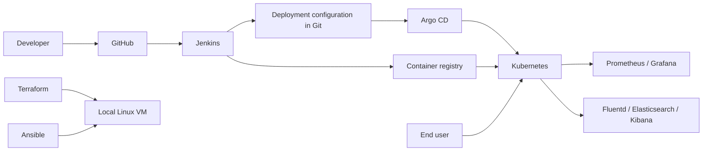

# Task Manager — End-to-End DevOps Capstone

DevOps & Automation Lab (ENSP461), B.Tech CSE, Semester VII.

## Problem statement

Users need a simple way to track tasks. Developers need repeatable, automated delivery so that changes can be tested, packaged, deployed, and observed reliably. This project uses a small Task Manager application to demonstrate that delivery process phase by phase.

## Objectives

- Build a responsive Task Manager with a database and REST APIs.
- Demonstrate Git history, branches, merges, and conflict resolution.
- Automate building, testing, packaging, and deployment.
- Add reproducible infrastructure, monitoring, logging, and security.
- Demonstrate a deployment strategy and GitOps reconciliation.

## Current application

Implemented: project overview and phase-by-phase roadmap. Application code, tests, and evaluation evidence are planned.

Planned: registration/login, password hashing, user-owned tasks, priority, and all later DevOps integrations. Today's app is a local, single-user demonstration. It has no authentication and should remain on localhost until authentication is implemented.

Git evidence and GitHub publication will be recorded by the student in later checkpoints. Do not mark them complete until the actual history and remote repository exist.

## Planned tools and final setup

The setup and API descriptions below describe the completed starter. Follow START-HERE.md outside the repository for the checks available at this checkpoint.

## Tools and setup

Node.js 24 LTS, Express 5, built-in Node SQLite, plain HTML/CSS/JavaScript, and Git. Built-in SQLite avoids a separate database installation or native dependency build. Some Node 24 releases print an experimental SQLite warning; it does not indicate a failed test.

Install Node.js 24 LTS from https://nodejs.org/en/download, reopen your terminal, and check `node --version` and `npm --version`.

```powershell
npm ci
Copy-Item .env.example .env
npm start
```

Open http://localhost:3000. Use `npm run dev` for automatic server restarts and `npm test` for the test suite. Stop the server with Ctrl+C. The default database is `data/tasks.db`, created automatically. Restarting preserves tasks. `.env` is optional; defaults work without it. Relative database paths are relative to the directory from which you start the app.

| Configuration | Default |
|---|---|
| `PORT` | `3000` |
| `DATABASE_PATH` | `./data/tasks.db` |

The server binds to `127.0.0.1` for the local evaluation. Containerization will make the bind address configurable.

## REST interface

| Method | Path | Behavior |
|---|---|---|
| GET | `/health` | HTTP 200, `{"status":"ok"}` |
| GET | `/api/tasks` | Task array, newest first |
| POST | `/api/tasks` | Create with `{"title":"Prepare evaluation"}`; HTTP 201 |
| PATCH | `/api/tasks/:id` | Update title and/or boolean `completed`; HTTP 200 |
| DELETE | `/api/tasks/:id` | Delete; HTTP 204 with no body |

A task has `id`, `title`, `completed`, and `createdAt` (UTC timestamp). Titles are trimmed and limited to 1–200 characters. Missing tasks return 404; invalid input returns 400; errors use `{"error":"message"}`. Requests containing JSON need `Content-Type: application/json`. Database queries use bound parameters, and task titles are rendered as text.

## Architecture

Today: browser → Express (page + REST API) → SQLite file.

Planned delivery: developer → GitHub → Jenkins (test, analyze, package, build image) → container registry. Jenkins updates the deployment configuration in Git; Argo CD reconciles that configuration into Kubernetes. Prometheus/Grafana observe metrics; Fluentd forwards logs to Elasticsearch/Kibana. The browser reaches the deployed application through a Kubernetes Service. Ansible configures infrastructure provisioned by Terraform.



## Phase-by-phase roadmap

| Phase | Work | Evidence | Status |
|---|---|---|---|
| 1 — Git | GitHub, commits, branches, merge, conflict resolution | Repository URL and actual Git history | Starter ready; student records evidence |
| 2 — Jenkins | Automatic build, tests, packaging after every push | Trigger configuration and successful pipeline | Planned |
| 3 — Docker | Dockerfile, image, Compose, PostgreSQL migration | Entire application runs in containers | Planned |
| 4 — Kubernetes | Deployment, Service, ConfigMap, Secret, persistent database volume | Scaling, rolling update, rollback | Planned |
| 5 — Ansible | Docker/Kubernetes installation, deployment, configuration | Repeatable playbooks | Planned |
| 6 — Terraform | Local VM infrastructure, variables, outputs, module | Reproducible provisioning | Planned |
| 7 — Monitoring | Prometheus and Grafana | CPU, memory, container health, application metrics | Planned |
| 8 — Logging | Fluentd plus Elasticsearch/Kibana | Application, container, Kubernetes logs | Planned |
| 9 — Security | SonarQube, secrets, secure images, RBAC, Jenkins credentials | Analysis and security configuration | Planned |
| 10 — Strategy | Blue-green deployment | Traffic switch and recovery | Planned |
| 11 — GitOps | Argo CD | Git-driven reconciliation | Planned |

Complete authentication and remaining application requirements before Phase 3. Replace SQLite with PostgreSQL in Phase 3 and recreate disposable demonstration data. Production data migration is outside this capstone. Run later tools locally and verify virtualization/resources before choosing the Terraform VM provider.

Suggested course schedule: Week 1 Git/application; Week 2 Jenkins/Docker; Week 3 Kubernetes/Ansible; Week 4 Terraform/monitoring; Week 5 logging/security; Week 6 GitOps/deployment strategy; Week 7 integration/documentation/demo. Keep required work ahead of optional bonus features.

## Verification and final deliverables

`npm test` exercises the real HTTP API with isolated databases, including CRUD, newest-first ordering, validation, missing IDs, and persistence after reopening. The evaluation guide will be added at checkpoint 6.

Final submission: GitHub source repository containing the application and all automation/configuration files; report of at most 20 pages (problem, objectives, architecture, tools, screenshots, results, challenges, future scope); architecture diagram; 10-minute presentation; optional 10–15-minute demo video.
